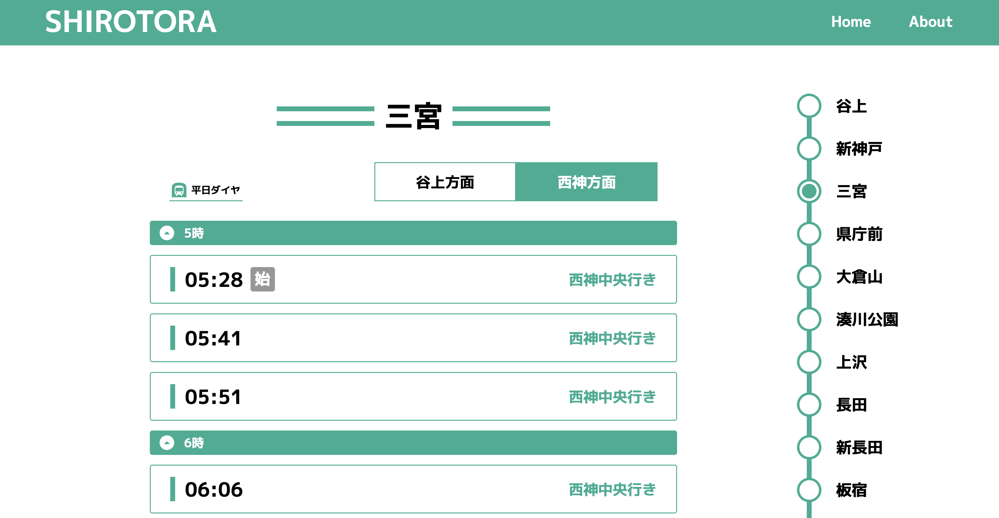

<div align="center">
  
</div>

<h1 align="center">Shirotora</h1>

<div align="center">
  
  
  
  
  
  
</div>

<br>

<p align="center">
SHIROTORAは、神戸市営地下鉄の西神・山手線の時刻表を見やすく表示してくれるWebアプリケーションです。<br>NAVITIMEからAPI Routesを通してスクレイピングしているため重いですが、それでも使いたい人は使ってください。</p>

## ✨ Product

- SHIROTORA: https://shirotora.vercel.app

<br>
<div align="center">

</div>
<br>

## 🔨 Requirement

- Vercel
- Node.js `18.12.1`

## 🚧 Development

- プロジェクト依存関係のインストール

```
yarn install
```

- ローカル開発環境の起動(http://localhost:3000)

```
yarn dev
```

- ローカル本番環境の起動(http://localhost:3000)

```
yarn build && yarn start
```

## 🧩 External Dependencies

SHIROTORAでは、外部サイトからスクレイピングを通してリアルタイムに時刻表を取得しています。そのため、交通遅延および外部サイトの仕様変更などが発生した場合は、正しい情報が表示されなくなる可能性があります。

- 神戸市営地下鉄HP
  - https://www.city.kobe.lg.jp/a80062/kurashi/access/kotsukyoku/subway/index.html

- NAVITIME(神戸市営西神・山手線の時刻表 駅一覧)
  - https://www.navitime.co.jp/diagram/stationList?lineId=00000703&from=diagram.campany.top